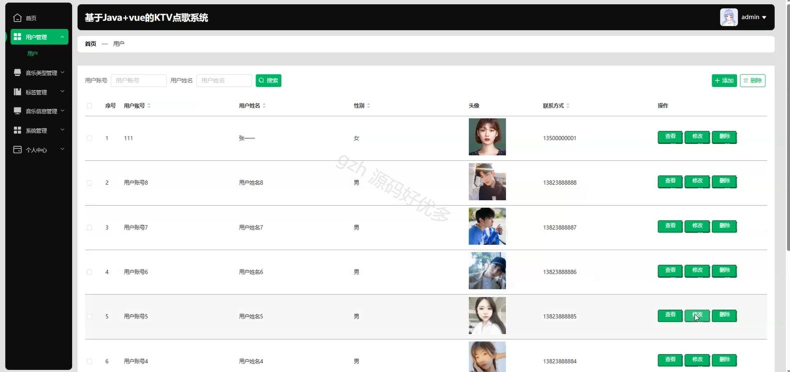

# springbootA386D
springbootA386D基于Java+vue的KTV点歌系统
## 查看主页获取源码

### 一、关键词

点歌系统、音乐播放、音乐系统

 

### 二、作品包含

源码+数据库+设计文档万字+全套环境和工具资源+部署教程

 

### 三、项目技术

前端技术：Html、Css、Js、Vue2.0、Element-ui 
后端技术：Java、SpringBoot2.0、MyBatis

  

 

### 四、运行环境（以下版本亲测，其他版本未知，请自测）

开发工具：IDEA/eclipse  + VSCODE

数据库：MySQL5.7（最低要5.7版本）

数据库管理工具：Navicat10以上版本

环境配置软件： JDK1.8 + Maven3.6.3

前端Nodejs：14

浏览器：谷歌浏览器

 

### 五、项目介绍

项目编号：springbootA386D

KTV 点歌系统是用于为用户提供歌曲搜索、点播、播放控制等功能，以满足娱乐场所内唱歌娱乐需求的系统。

角色：管理员、用户

管理员：首页、用户管理、音乐类型管理、标签管理、音乐信息管理、系统管理、个人中心。

用户：系统首页、音乐信息、公告资讯、个人中心、修改密码、我的收藏。

 

### 六、运行截图

